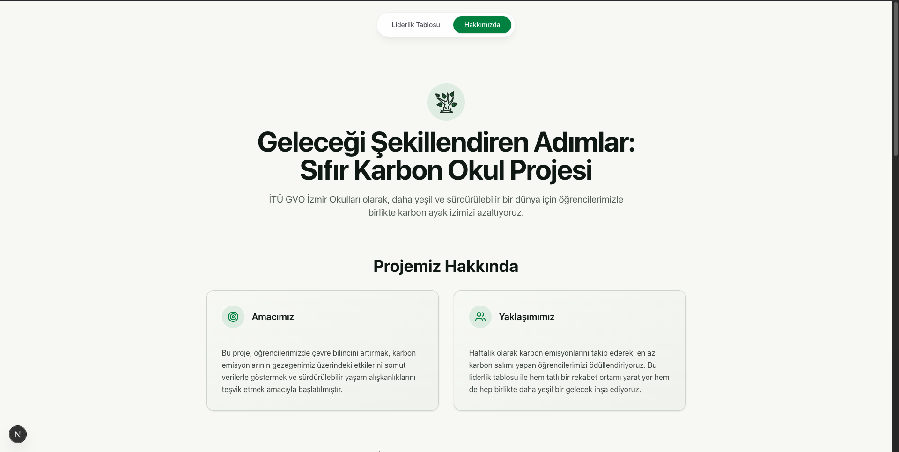
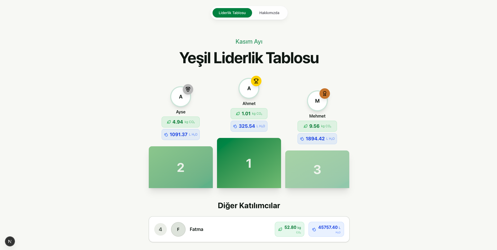
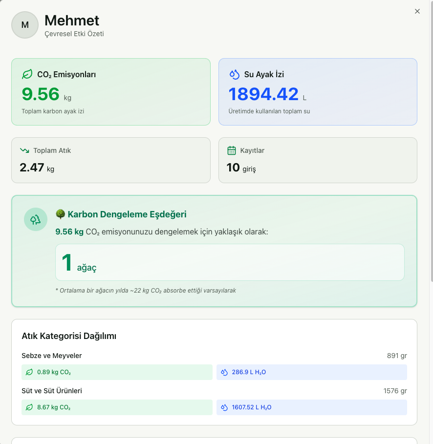

# Tabaktan Ormana — Living School Forest

The project now includes individual procedural trees, recoverable plant health, school forests, card sign-in, personal progress, and collective goals. Every post-meal card scan is compared with configured constant meal averages. Signed-out visitors can explore a clearly labeled interactive preview.

See [setup and API changes](docs/living-forest-setup.md) before connecting devices or migrating existing records. In particular, configure `API_KEYS` and meal baselines; previously public integration reads now require authentication.

For the experimental one-school, ten-student database, see [showcase data and test cards](docs/showcase-data.md). Run `npm run seed:showcase` to recreate it on a fresh checkout after copying `.env.example` to `.env.local`.

The original project background follows.

# Zero Carbon School Project (Zero Carbon SP)


## About the Project

The Zero Carbon School Project is an environmental sustainability initiative aimed at raising students’ ecological awareness and encouraging sustainable lifestyle habits. Through a weekly carbon emissions leaderboard, this project rewards students and encourages them to take an active role in tracking food waste and reducing their carbon footprint.

The physical data for this system is collected using custom-built smart bins designed, constructed, and deployed in participating schools as part of this project.


## Key Features

*   **Weekly Carbon Emissions Leaderboard**: Tracks students’ carbon footprints and rewards those with the lowest emissions.
*   **Food Waste Tracking and Calculation**: Calculates CO2 emissions and water footprint based on the type and weight of food waste generated in the cafeteria.
*   **Student Reward System**: Offers weekly rewards to encourage eco-friendly behavior.
*   **Detailed Environmental Impact Statistics**: Displays each student’s total CO2 emissions, water footprint, and waste category distribution.
*   **API Key-Protected Management**: Provides secure API access for user and waste records.
*   **Responsive and Accessible Interface**: Offers a modern experience, including dark mode support.


### Waste Entry Modal

## How Does the System Work?

1.  **Waste Input and Identification**: Students dispose of post-meal food waste (meat, dairy, plant-based) into the custom-built smart waste bins placed in their schools. They identify themselves to the system by swiping their student cards.
2.  **Calculation**: The smart bin measures the weight of the waste, and the backend system automatically calculates the CO₂ emissions and water footprint based on the specific food category.
3.  **Leaderboard and Rewards**: The calculated data is instantly updated on the leaderboard. At the end of the week, students with the lowest carbon footprint are recognized and rewarded.

## Technology Stack

*   **Frontend**: Next.js, React, TypeScript, Tailwind CSS, Shadcn UI (Radix UI), Recharts (data visualization), Lucide React (icons).
*   **Backend**: Next.js API Routes, Node.js, TypeScript.
*   **Database**: SQLite.
*   **Authentication**: API key-based authentication for write operations.

## Project Team

*   **Project Advisor**: Yasemin Bilgin Kırkgöz
*   **Team Member**: Aksel Eruysal (Technical infrastructure design and development)
*   **Team Member**: Mehmet Emir Özdiş (Data analysis and leaderboard strategy management) 

## Setup and Development (Local)

To run this Next.js project locally, follow these steps:

1.  Clone the repository:
    ```bash
    git clone https://github.com/emirozdis/zerocarbonsp.com.git
    cd zerocarbonsp.com
    ```

2.  Install dependencies:
    ```bash
    npm install
    ```

3.  Configure the environment variables by creating a `.env.local` file in the root directory:
    ```env
    API_KEYS=dev_key_admin_1,dev_key_device_2
    ```

4.  Start the application in development mode:
    ```bash
    npm run dev
    ```

The application will be accessible locally at `http://localhost:3000`.